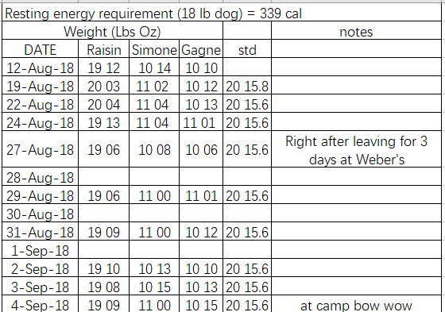

```{r setup, include = FALSE, message = FALSE, warning = FALSE}
# global default settings for chunks
knitr::opts_chunk$set(echo = TRUE, warning = FALSE, message = FALSE,
                      fig.width = 10, 
                      fig.align = "center"
                      )
# loaded packages; placed here to be able to load global settings
Packages <- c("tidyverse", "dplyr", "rvest", "httr", "XML", "readxl", "fragilityindex", "kableExtra")
library(patchwork)
library(ggridges)
library(plotly)
library(mice)
invisible(lapply(Packages, library, character.only = TRUE))
# global settings for color palettes
options(
  ggplot2.continuous.colour = "viridis",
  ggplot2.continuous.fill = "viridis"
)
scale_colour_discrete = scale_colour_viridis_d
scale_fill_discrete = scale_fill_viridis_d
# theme global setting for ggplot
theme_set(theme_minimal() + 
            theme(legend.position = "bottom") +
            theme(plot.title = element_text(hjust = 0.5, size = 12),
                  plot.subtitle = element_text(hjust = 0.5, size = 8))
          )
```


## Import and clean data

#### Change the format of Date in Excel
     


#### Tidy data in R
```{r}
dogweights = 
  read_excel("./data/dog _weights.xlsx", range = "B3:E185") %>%
  janitor::clean_names() %>% 
  mutate(day_n = as.Date(date)-as.Date('2018-08-12')) %>%
  separate(raisin, into = c("raisin_lbs", "raisin_os"), sep = " ") %>% 
  mutate(raisin_lbs = round(as.numeric(raisin_lbs) + as.numeric(raisin_os)/16, digits = 2)) %>%
  separate(simone, into = c("simone_lbs", "simone_os"), sep = " ") %>%
  mutate(simone_lbs = round(as.numeric(simone_lbs) + as.numeric(simone_os)/16, digits = 2)) %>%
  separate(gagne, into = c("gagne_lbs", "gagne_os"), sep = " ") %>%
  mutate(gagne_lbs = round(as.numeric(gagne_lbs) + as.numeric(gagne_os)/16, digits = 2)) %>% 
  select(day_n, date, raisin_lbs, simone_lbs, gagne_lbs)
```
lbs os - Lbs

#### Show the first five rows
```{r}
dogweights[1:5,] %>% 
  knitr::kable(align = 'c')
```

## Visualization

#### Weights of dogs
```{r}
weights_time = 
  dogweights %>%  # wired data
  mutate(
      Raisin = raisin_lbs, Simone = simone_lbs, Gagne = gagne_lbs) %>%
  pivot_longer(
    Raisin:Gagne,
    names_to = "Name",
    values_to = "Weights")

weightplot2 = 
  ggplot(weights_time, aes(x = Name, y = Weights, fill = Name)) +
  labs(title = "Weights of dogs",
       x = "Dog",
       y = "Lbs") + 
  geom_violin(alpha = 0.5, size = 0.5, color = "blue") + 
  stat_summary(fun.y = median, geom = "point", color = "blue", size = 3)

ggplotly(weightplot2)
```
Get rid of the outlier in Rasin.


#### Weights over time

```{r}
weightplot2 = 
  ggplot(weights_time[-367,], aes(x = date, y = Weights, color = Name)) +
  labs(title = "Weights over time",
       subtitle = "",
       x = "Time",
       y = "Lbs",
       caption = "Data from friend of jeff") + 
  geom_point(alpha = 0.5, size = 0.7) + 
  geom_smooth(size = 0.5, alpha = .8, se = F) + 
  theme(axis.text.y = element_text(color = "black", 
                                   size = 10,  hjust = 1), 
        axis.text.x = element_text(angle = 45, 
                                   hjust = 1, size = 10))

ggplotly(weightplot2)
```


