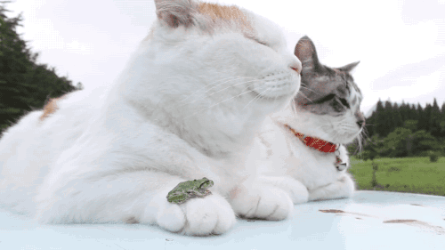

###  Hi!

 

***

## Yuanzhi Yu(Fisher)

### Education

Expected May 2021  
**Columbia University Mailman School of Public Health**  
*Master of Science, Biostatistic*  

09/2015 – 06/2019  
**Wuhan University**  
*Bachelor of science in Life Science and Biotechnology*

06/2018 – 08/2018  
**Massachusetts institute of technology**  
*Exchange student, Biomedical engineering*

***

### Research and Internships

#### Pfizer, Hangzhou, China

##### Quality Control (QC)

**01/2019 - 05/2019**

- Conducted analysis of trends in Water and Environmental Monitoring to ensure quality of drug production                                                                       
- Drug Quality Inspector: Inspected drug quality using analytics software to track drug production 
- Reached a better understanding of management

#### Liu Yong Biomedical Laboratory

##### Research Associate

**03/2017 - 06/2019**

- Investigated the influence of experimental parameters and wrote final assessment for thesis
- Collected articles and conducted literature review from the Pubmed database on metabolic immunity and diabetes and summarized for research team/journal club 
- Characterized biochemical compositions and accurately followed research protocols to conduct DNA, RNA and protein extraction techniques 

	
#### MIT Biobuilder Summer Biology Experimental Project

##### Intern

**06/2018 - 08/2018**

- Conducted independent research related to bioengineering; attended seminar about biological sequencing
- Exchanged ideas with CEOs of start-ups
 
	
#### Pfizer, Dalian China

##### Quality Assurance

**12/2015-3/2016**

- Drug Quality Inspector                                                                   
- Learned to inspect drug quality for a company producing a high volume of pharmaceutical products

***
	
### Publications

##### 1.Yang Zhanning, Yu Yuanzhi, Toxic effects of single-armed carbon nanotubes on Pacific Crassostrea gigas[J]. Journal of Ecotoxicology,2019,14(01):90-98.

##### 2.Yu Yuanzhi. Advances in molecular mechanisms of metabolic related signal transduction in type 2 diabetes[J]. Letters of Biotechnology,2018,29(04):564-570.

***
	
### Extracurricular Activities

#### Student Union of Wuhan University
##### Vice president
- Merit Student
- First Prize Scholarship, Wuhan University
- Host and organize student sponsored activities for School of Life Science
- Joined in the “Top Talent Training” Program several times

#### International Exchange Division
##### Deputy Director
- Led our team members to host and arrange international exchange program, international conference such as the Youth Leaders’ Summit
- Award for Excellent Leadership, Wuhan University

***

*One’s real life is often the life that one does not lead.*
 

Life sucks, me cute.